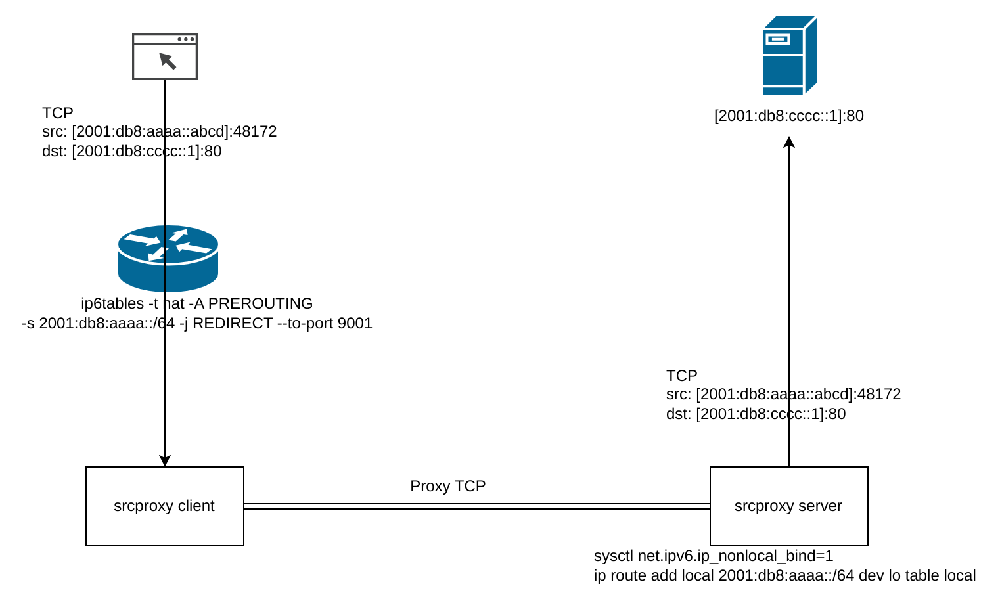

srcproxy
=================

srcproxy is a TCP-only proxy protocol aimed at preserving the source address of
the client side. 
The proxy client of srcproxy sends source address information to the proxy
server, and the proxy server establishes a TCP connection to the proxy
destination using the original source address (with `ip(7):IP_FREEBIND`).



Compared to other Layer 4 proxies, srcproxy allows you to preserve the
client-side address. For example, you can provide proxy service to multiple
users and allow them to have their own source address space.

Compared to Layer 3 VPN, srcproxy allows you to use customised tools to
optimise the TCP stack.

srcproxy now only supports Linux, as it requires iptables REDIRECT target for
inbound and `ip(7):IP_FREEBIND` to `bind(2)` any address in the specified prefix.


## Configuration

### Server

```bash
./srcproxy server config.json
```

```json5
{
  "listen": "192.0.2.1:21829", // The listen address for connection from clients, it is recommended to use a specific address instead of 0.0.0.0
  "acl": [  // (Optional) The ACL policy for restricting source addresses can be used by different clients.
    // An empty "acl" array would completely disable the ACL feature.
    {
      "auth": "613200f2-0af9-40e3-9dc2-a5d6f365db1b",  // The "auth" field in the client-side configuration, used to distinguish each client.
      "allowed_src_ips": [  // (Optional) Prefixes that this client can use as source addresses.
        "192.0.2.128/25",
        "2001:db8:aaaa::/64"
      ],
    },
    {
      "auth": "", // A blank "auth" is acceptable and will only match a blank "auth" field in the client configuration.
      "allowed_src_ips": [
        // An empty "allowed_src_ips" array is acceptable, and it will allow this client to use any address as a source address.
      ],
    },
  ],
  "timeout": "5m", // (Optional) Connect & idle timeout of each TCP connection, accepting strings such as "5m", "300s" and integer number (for seconds) as any other proxy tools do.
  "log_level": "info", // (Optional) Log level, accepting "info" and "error".
}
```

You will need to manually add prefixes used as source addresses to the route
table.

```bash
ip -6 route add local 2001:db8:aaaa::/64 dev lo table 30
ip -6 rule add to 2001:db8:aaaa::/64 ipproto tcp lookup 30 pref 30000
```

Note that adding the above route would cause all TCP traffic sent to
2001:db8:aaaa::/64 to be routed to local addresses only. This would also
prevent any incoming TCP connections to 2001:db8:aaaa::/64 from being
established.


### Client

```bash
./srcproxy client config.json
```

```json5
{
  "inbound": {
    "mode": "redirect", // (Optional) Only supports iptables -j REDIRECT now.
    "listen": ":9001"  // The listen address for REDIRECT --to-port. Consider specifying just the port part, so it would listen for both IPv4 and IPv6.
  },
  "outbound": {
    "server": "192.0.2.1:21829",  // The address of the srcproxy server.
    "auth": "613200f2-0af9-40e3-9dc2-a5d6f365db1b", // (Optional) The auth credential for the ACL policy on the server side.
    "local_addr": "192.0.2.2%eth0", // (Optional) bind(2) to the specified source address/interface when connecting to the server.
    "fwmark": 0x1234,  // (Optional) Set the specified fwmark when connecting to the server.
  },
  "timeout": "5m", // (Optional) Connect & idle timeout of each TCP connection, accepting strings such as "5m", "300s" and integer number (for seconds) as any other proxy tools do.
  "log_level": "info", // (Optional) Log level, accepting "info" and "error".
}
```

You will need to manually add iptables rules to redirect TCP traffic to the
srcproxy client.

```bash
ip6tables -t nat -A PREROUTING -s 2001:db8:aaaa::/64 -j REDIRECT --to-port 9001
```

As srcproxy only supports TCP, you may need a Layer 3 VPN for other protocols
such as UDP and ICMP.


## Security

The security of srcproxy should be the same as plain SOCKS5, as there is no
data/key encryption in this protocol.

I personally recommend forwarding the port of the srcproxy server with the
"relay" feature of other secure proxy tools (such as SSH and Hysteria).
